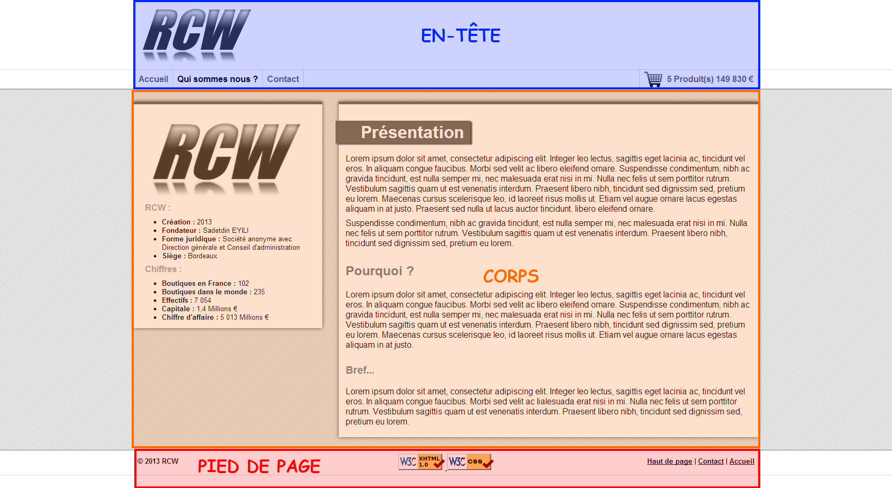
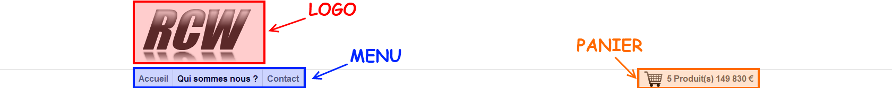
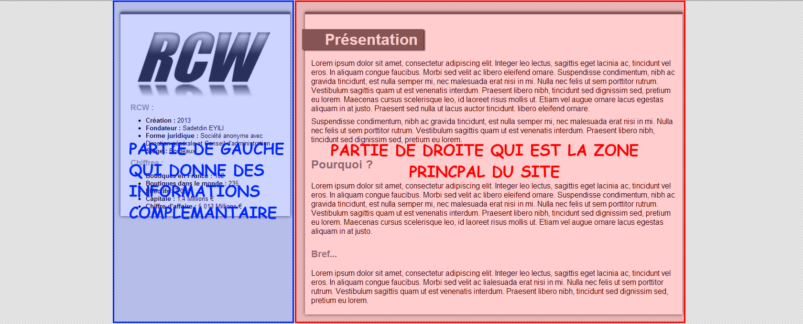
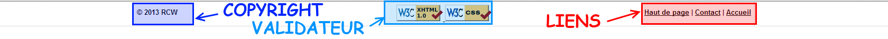

CONSERVATOIRE NATIONAL DES ARTS ET METIERS AQUITAINE

# Projet NFA016

Réalisation d’une mini application de vente en ligne.

 - **Unité d’Enseignement :** NFA016 Développement web - Architecture du web et développement côté client
 - **Année :** 2012 - 2013
 - **Auteur :** Sadetdin EYILI
 - **Demo :** https://sad270.github.io/RCW

## I/ Description du projet

- Objectifs :

On désire réaliser un site internet de vente en ligne (au minimum 3 produits), le site doit avoir une page de présentation, une page par produit, une page contact avec un formulaire de contact. On peut aussi ajouter une page panier contenant un formulaire pour l’achat des produits.

- Présentation :

RCW est une SA en pleine expansion qui cherche à se faire une place sur la toile, elle est spécialisé dans la vente de voitures, particulièrement la Volkswagen Golf, la Citroën C4 et la Renault Mégane.

- Navigation :

Ce site doit mettre en avant ses produits, et mettre l’utilisateur en confiance. Et ça toute en gardant une simplicité et une ergonomie sur la navigation entre les pages, ceci se fera grâce à la structure des pages, l’arborescence du site ainsi que la charte graphique. Nous verrons tous ces éléments dans la suite du rapport

## II/ Structure des pages

Le site présente une structure de page assez classique, c’est-à-dire. Un logo sur le coin supérieur gauche, dessous ce logo, un menu horizontal. Puis le corps de la page est séparé en deux parties verticales, celle de gauche est plus petite et elle est là pour donner à la partie de droite des informations complémentaires (prix, avantages inconvenants, adresse etc.). La partie de droite, quant à elle, elle est la "pièce à vivre" c’est la ou les yeux de l’internaute passeront le plus de temps, elle contient toute l’information.

Cette structure est représentée dans le « VI. Élaboration d’une maquette » afin de ne pas perturber l’internaute, cette structure est conservée sur toutes les pages du site.

## III/ Référencement
Le référencement d’un site est très important, car il permet aux internautes de trouver le site, et il permet aux webmasters, de faire sortir leurs sites parmi les millions d’autres présents sur la toile. Vous trouverez ci-dessous une liste de chaque page du site avec son titre, sa description, et ses mots-clés. Ces informations sont également présentes sur leurs pages respectives.

- **index.html**
  - **Titre** : RCW | Les spécialiste de la C4, Megane et Golf - Projet WEB Cnam -
  - **Description** : Vente de voitures neuves, avec la qualité au rendez-vous - Projet WEB Cnam -
  - **Mots-clés** : RCW, Renault, citroen, volkswagen, megane, c4, golf, golf 7, voiture, comparatif, essai

- **contact.html**
  - **Titre** : Contactez-nous - RCW | Les spécialiste de la C4, Megane et Golf - Projet WEB Cnam -
  - **Description** : Une question ? Un renseignement ? N’hésitez pas à nous contacter ! | RCW - Vente de voitures neuves, avec la qualité au rendez-vous - Projet WEB Cnam -
  - **Mots-clés** : RCW, contact, adresse, mail, telephone, Renault, citroen, volkswagen, megane, c4, golf, golf 7, voiture, comparatif, essai

- **golf7.html**
  - **Titre** : Volkswagen Golf 7 - RCW | Les spécialiste de la C4, Megane et Golf - Projet WEB Cnam -
  - **Description** : Basée sur la plateforme MQB, la nouvelle Golf affiche quelques changements... mais pas au niveau du design ! Deux ans avant de fêter son quarantième anniversaire, la Volkswagen Golf 7 semble plus dynamique. - Projet WEB Cnam -
  - **Mots-clés** : RCW, volkswagen, golf, golf 7, voiture, comparatif, essai, prix, pas chere

- **megane3.html**
  - **Titre** : Renault Mégane - RCW | Les spécialiste de la C4, Megane et Golf - Projet WEB Cnam -
  - **Description** : Très attendue, la 3ème génération de Mégane ne doit pas décevoir. L'avenir de Renault en dépend. Faut-il y trouver là la raison de son look plus consensuel ? - Projet WEB Cnam -
  - **Mots-clés** : RCW, renault, megane, megane 3, voiture, comparatif, essai, prix, pas chere

- **c4.html**
  - **Titre** : Citroën C4 - RCW | Les spécialiste de la C4, Megane et Golf - Projet WEB Cnam -
  - **Description** : La nouvelle Citroën C4 atteint aujourd'hui l'âge de raison et se pare d'une sobriété et d'une rigueur toute germanique. Citroën insiste aussi sur le fait qu'en gagnant en gabarit (4,33 m de long, 1,79 m de large et 1,49 m de haut). - Projet WEB Cnam –
  - **Mots-clés** : RCW, citroen, c4, c4 II, voiture, comparatif, essai, prix, pas chere

- **about_us.html**
  - **Titre** : Qui sommes-nous ? - RCW | Les spécialiste de la C4, Megane et Golf - Projet WEB Cnam -
  - **Description** : RCW Fondé en 2013 par EYILI Sadetdin est une société anonyme, son siège est à Bordeaux - Projet WEB Cnam -
  - **Mots-clés** : RCW, Renault, citroen, volkswagen, megane, c4, golf, golf 7, voiture, comparatif, essai, presentation rcw

- **cart.html**
  - **Titre** : Panier - RCW | Les spécialiste de la C4, Megane et Golf - Projet WEB Cnam -
  - **Description** : Passer à l'achat ! | RCW - Vente de voitures neuves, avec la qualité au rendez-vous - Projet WEB Cnam -
  - **Mots-clés** : RCW, Renault, citroen, volkswagen, megane, c4, golf, golf 7, voiture, comparatif, essai

## IV/ Arborescence du site

Comme beaucoup de site de vente en ligne, sur la page accueil, il y a une brève présentation des produits et il est possible d’ajouter des produits dans le panier, d’accéder à la fiche de présentation du produit.

L’accès aux différentes pages du site se font à l’aide du menu présent en haut de la page. Ce menu est constitué d’une part de liens vers les pages accueil, qui sommes-nous et contact. (à Gauche), d’autre part d’un aperçut du panier (nombre de produit, et prix total) avec un lien pour accéder directement au panier.

Il y a aussi un pied de page qui est là pour “clôturer” chaque page, et donner des informations complémentaires comme le copyright, il y aussi un lien vers le haut de page, pour que l’utilisateur puisse rapidement remonter sur les longues pages, puis un lien vers les pages contact et accueil.

## V/ Charte Graphique

Afin de faciliter sa navigation, la police du site est standard le logo est assez simple et le site est un maximum possible aéré et clair. Mais il essaie de garder une modernité. On le voit avec en-tête et le pied de page de fond blanc et qui gardent des traies qui font toute la longueur de la page, mais aussi avec le corps de la page dont les éléments sont en fond blanc avec une ombre pour ne pas se mélanger à l’arrière-plan gris clair rayé de blanc. Il y a aussi un code couleur par produits qui permet à l’utilisateur de facilement voire qu’elle cadre représente qu’elle article.

## VI/ Élaboration d’une maquette

 - Vue d'ensemble

 - En-tête

 - Corps

 - Pied de page

## VII/ Conclusion

Le site reste assez simple, avec quelques touches de modernité. Ceci permet aux internautes de rapidement avoir leurs repères, mais le site ne se démarque pas réellement des autres sites. Pour qu’il se démarque un peu plus il faudrait lui ajouter un peu plus d’animation par exemple lors de l’ajout d'un produit dans le panier, ou alors affiché un petit cadre qui montre le contenu du panier lorsqu’on passe la souris sur le panier, mettre un diaporama de photos pour les produits, mettre des fondus vers le noir transparent et un petit cadre au milieu qui afficherait le résultat de l’envoi du message ou alors de l’achat. Mais il faudrait aussi lui ajouter un peu plus d’interactivité par exemple la possibilité de laisser des commentaires sur un produit de le noté. Il faudrait aussi lui mettre un peu plus de couleur sur les formulaires, au aussi partager le formulaire d’achat en trois étapes indentification, adresse, et paiement (+ sondage).

## Licence

MIT
